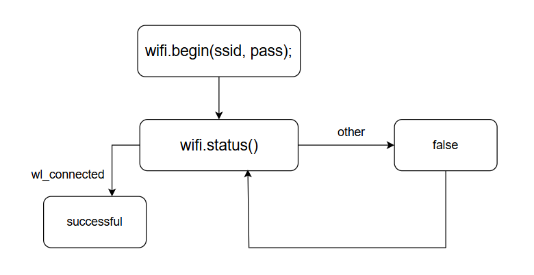

# <WiFi.h>
## API
``` C
/**
 * @brief: Connect Wifi
*/
WiFi.begin(const char* ssid, const char*  pass);
/**
 * @brief: Check Wifi connect status
 * @retval: enum wl_status_t
*/
WiFi.status();
/**
 * @brief: Check Wifi get local IP 
*/
WiFi.localIP();
```

## Diagram

