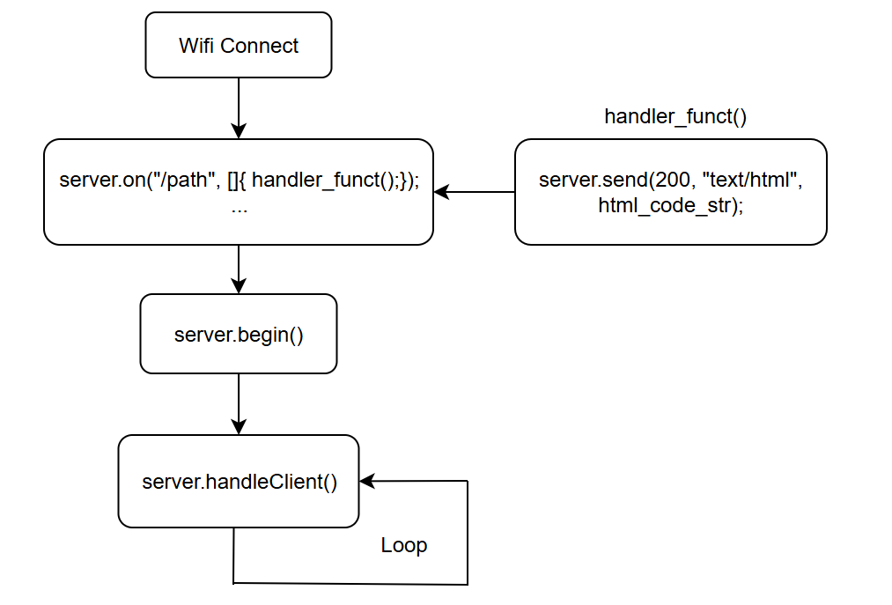

# <WebServer.h>

## API
``` C
/**
 * @brief:Gửi một phản hồi HTTP với mã trạng thái 200 (thành công), nội dung là một trang HTML (text/html), và nội dung cụ thể được lưu trong biến MAIN_page.
 * @param[200]: mã trạng thái thành công
 * @param[text/html]: định nghĩa phần dữ liệu gửi đi là html
 * @param[MAIN_page]: biến chứa nội dung html
*/
server.send(200, "text/html", MAIN_page);

/**
 * @brief: Được dùng để đăng ký một Handle_funct() cho một đường dẫn (path) cụ thể trên server.
 * @param["/(path)"]: bất cứ nào webserver tạo ra đường dẫn "/(path)" chương trình sẽ nhẩy vào hàm xử lý Handle_funct()
 * @param[ []{Handle_funct();} ]: định nghĩa hàm ẩn khi xuất hiện đường dẫn (path) cụ thể trên server.
*/
server.on("/(path)", [] { Handle_funct(); });

void Handle_funct()
{
    // xử lý
}

/**
 * @brief: Khởi động web server và bắt đầu lắng nghe các yêu cầu từ client.
*/
server.begin();

/**
 * @brief: Xử lý tất cả các yêu cầu từ client đang chờ xử lý và thực hiện các phản hồi tương ứng. Duy trì hoạt đông server liên tục
*/
server.handleClient();

/**
 * @brief: lấy giá trị tham số trong URL 
 * @param["Key"]: tham số muốn lấy giá trị
 * @retval: giá trị của tham số
 * @note: URL: URL (http://192.168.1.1/GET?key=25&mode=on) return 25
*/
server.arg("Key")
```
## Diagram
- Khời động webserver \


## Html
### 1. Cấu trúc cơ bản của html
- Cấu trúc câu lệnh

- Cấu trúc chương trình htlm 
``` html
<!DOCTYPE html>
<html lang="en">
<head>
    <meta charset="UTF-8">
    <title>Tiêu đề trang web</title>
</head>
<script>
    // function javascript
<script>
<!-- tự động gọi js_funct: UpdateData() khi trang tải xong   -->
<body onload="UpdateData()">
    <!-- triển khai code ở body -->

</body>
</html>
```
### 2. Câu lệnh cơ bản 
- header: trong html có 6 header
``` html
<h1 id = "id1">Tiêu đề 1</h1>
<h2 id = "id2">Tiêu đề 2</h2>
<h3 id = "id3">Tiêu đề 3</h3>
<h4 id = "id4">Tiêu đề 4</h4>
<h5 id = "id5">Tiêu đề 5</h5>
<h6 id = "id6">Tiêu đề 6</h6>
```
- button
``` html
<script>
    function button_funct()
    {
        // hàm xử lý nut ấn
    }
</script>
<button id = "bnt1" onclick = button_funct()>tên nut ấn</button>
```
- input
``` html
<input>  
```
## Css
## Javascript
``` javascript
function UpdateData(){
// Tạo một đối tượng XMLHttpRequest mới và gán nó vào biến xhttp
    var xhttp = new XMLHttpRequest();
/**
 *@brief : Mỗi khi trạng thái của yêu cầu HTTP thay đổi (ví dụ: từ đang gửi, đến nhận dữ liệu, đến hoàn tất), hàm này sẽ được gọi.
*/
    xhttp.onreadystatechange = function (){
/**
 * @param[this.readyState]:
    * 0: Yêu cầu chưa được khởi tạo.
    * 1: Kết nối đã được thiết lập.
    * 3: Đang xử lý phản hồi.    
    * 4: Yêu cầu đã hoàn tất và phản hồi đã sẵn sàng
 *@param[this.status]:
    * 200 : OK
    * 404 : Không tìm thấy
    * 500 : Lỗi server
*/
        if(this.readyState == 4 && this.status == 200)
        {
            // xử lý code ở đây
            var DataVDK  = xhttp.responseText;

            // hiển thị dữ liệu nhận được trong console
            console.log("Dữ liệu VDK:" + DataVDK);

            /* truy vấn giá trị trong JSON: varJON.elemnt */
            var DataJson = JSON.parse(DataVDK);  // đưa dữ liệu vào JSON
            /* Example:
            DataJson : {"ND":"844.79","DA":"921.61","TB1":"0","TB2":"0","EF":"3000"}
            DataJson.ND = 844.79
            DataJson.DA = 921.61
            */
            if(DataJson.ND != null)
            {
                // thay đổi phần tử có Id "ND"
                document.getElementById("ND").innerHTML = DataJson.ND;
            }
            // ... code ...
        }
    }
    // Khởi tạo một yêu cầu GET HTTP đến đường dẫn(URL) "/Update". true: bất đồng bộ. Nghĩa là code sẽ không bị chặn lại để chờ phản hồi từ server
    xhttp.open('GET','/Update',true);
    xhttp.send(); 
    // Tự động gọi hàm UpdateData() lại sau 2 giây(2000 mils)
    setTimeout(function(){ UpdateData() }, 2000);
}
```


