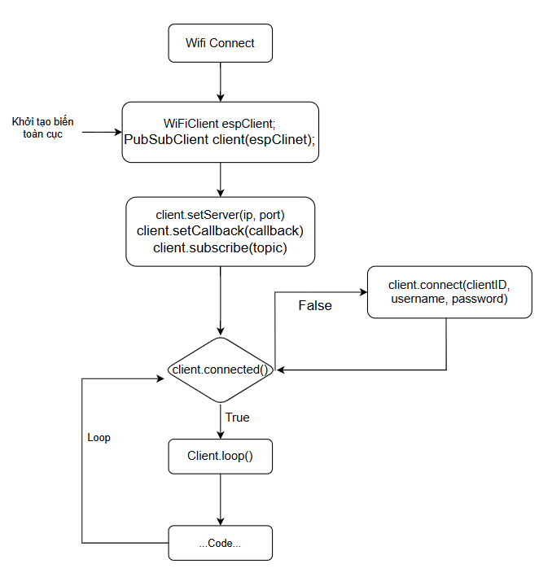

# ESP32 MQTT <PubSubClient.h>
## I. Giới thiệu chung
### 1. Khái niệm
- MQTT (Message Queuing Telemetry Transport) là một giao thức truyền thông nhẹ, được thiết kế để trao đổi dữ liệu giữa các thiết bị trong môi trường có băng thông thấp, độ trễ cao hoặc không ổn định, đặc biệt phổ biến trong các ứng dụng IoT (Internet of Things).
- MQTT hoạt động theo mô hình publish/subscribe (xuất bản => gửi thông điệp đến MQTT Broker/ đăng ký=>nhận thông điệp)
### 2. Các thành phần chính của MQTT
- MQTT Broker: Là máy chủ trung gian chịu trách nhiệm nhận, quản lý và phân phối thông điệp giữa các thiết bị.
- Publisher: Thiết bị hoặc ứng dụng gửi (xuất bản) thông điệp tới broker
- Subscriber: Thiết bị hoặc ứng dụng đăng ký (subscribe) để nhận thông điệp từ broker
- Topic: Là "kênh" hoặc "chủ đề" mà thông điệp được gửi tới hoặc nhận từ.
- Client: Bất kỳ thiết bị nào (publisher hoặc subscriber) kết nối tới broker. Một client có thể vừa publish vừa subscribe.
## II. API
``` C
/**
 * Khai báo cần thiết 
*/
WiFiClient espClient;
PubSubClient client(espClient);

/**
 * @brief:Thiết lập kết nối tới MQTT broker
 * @param[ip]: Địa chỉ IP của MQTT broker (192.168.1.14) 
 * @param[domands]: tên miền (http:....)
 * @param[port]: Số cổng mà broker sử dụng để lắng nghe kết nối MQTT(1883/8883) 
*/
client.setServer(IPAddress ip, uint16_t port);
client.setServer(const char* domands, uint16_t port);

/**
 * @brief: Kết nối với MQTT broker
 * @param[clientId]: chuỗi định danh của thiết bị trong mqtt 
 * @param[username]: Tên người dùng để xác thực với broker (nếu broker yêu cầu).
 * @param[password]: Mật khẩu để xác thực (nếu broker yêu cầu). 
*/
client.connect(const char* clientId);
client.connect(const char* clientId, const char* username, const char* password);

/**
  * @brief: Kiểm tra kết nối với MQTT broker
*/
client.connected(void);

/**
 * @brief: xuất bản (publish) một thông điệp từ ESP tới MQTT broker
 * @param[topic]: chỉ định topic mà thông điệp sẽ được gửi tới => char*
 * @param[payload]: chứa nội dung thông điệp => char*
 * @param[retained]: Nếu true, broker sẽ lưu trữ thông điệp này làm retained message. Các subscriber mới đăng ký topic sẽ nhận được thông điệp này ngay lập tức.
 * @param[length]: là độ dài của payload.
*/
client.publish(const char* topic, const char*  payload);
client.publish(const char* topic, const char*  payload, boolean retained);
client.publish(const char* topic, const char*  payload, uint32_t length);

/**
 * @brief: thiết lập một hàm callback(hàm gọi lại) nhằm xử lý các thông điệp MQTT mà ESP nhận được từ broker khi nó đã đăng ký (subscribe) một topic
*/
void callback(char* topic, byte* payload, unsigned int length);
client.setCallback(void *callback());

/**
 * @brief: một phương thức dùng để đăng ký (subscribe) một topic cụ thể từ MQTT broker .Mỗi khi một publisher gửi thông điệp tới topic này, broker chuyển tiếp thông điệp. Thông điệp sẽ kích hoạn hàm callback đã được đăng ký trước đó
 * @param[topic]: chỉ định topic mà ESP muốn đăng ký 
 * @param[qos]: Chất lượng dịch vụ (Quality of Service) cho việc nhận thông điệp
    * 0: Nhận tối đa một lần (nhanh, không đảm bảo).
    * 1: Nhận ít nhất một lần (đảm bảo nhận, có thể trùng lặp).
    * 2: Nhận chính xác một lần (đảm bảo nhất, chậm hơn). 
*/
client.subscribe(const char* topic);
client.subscribe(const char* topic, uint8_t qos);
```

## III. Diagram


## IV. Mostqtto
### 1. Download and setup
### 2. Run a MQTT Broker in pc
- cmd => cd mostqito_path
- Server lắng nghe Topic từ các mqtt_client: 
``` sh
mosquitto_sub -h mqtt_ip -p mqtt_port -t Topic
mosquitto_sub -h mqtt_ip -p mqtt_port -t # => chạy toàn bộ topic
```
- trên client xuất bản một tin nhắn "message" cho Topic:  
``` sh
mosquitto_pub -h mqtt_ip -p mqtt_port -t Topic -m "message"
```
### 3. Web MQTT
#### HTML
``` html
<script src="https://cdnjs.cloudflare.com/ajax/libs/paho-mqtt/1.0.1/mqttws31.js" type="text/javascript"></script>
```
#### Javascript
``` javascript
var hostname = "192.168.1.13"; // Địa chỉ của ip server
var port = 9001; // kết nối port websockets
// id client => random => giúp hệ thống không bị reset
var clientId = String(parseInt(Math.random() * 100, 10));
clientId += new Date().getUTCMilliseconds();
// topic nhận dữ liệu => esp gửi dữ liệu ở topic nào để web subscribe
var topicpub = "pubdata";
// topic ESP nhận dữ liệu
var topicsub = "subdata";
// Tạo clinet MQTT
mqttClient = new Paho.MQTT.Client(hostname, port, clientId);

// đăng ký một hàm callback (MessageArrived) để xử lý khi client nhận được tin nhắn từ MQTT broker
mqttClient.onMessageArrived = MessageArrived; 

// đăng ký một hàm callback (MessageArrived) để xử lý khi sảy ra lỗi khi connect
mqttClient.onConnectionLost = ConnectionLost;

/* gọi hàm connect */
Connect();

/*Hàm callback khi kết nối thành công*/
function Connected() {
    console.log("Connected MQTT broker"); // println => monitor => để thấy nó có kết nối hay không
    // Kết nối xong thì đăng kí topic nhận dữ liệu
    mqttClient.subscribe(topicpub);
}
var DataSend = "client " + clientId + "tham gia vao mqtt broker";
mqttClient.send("subdata", DataSend, 2, false);

/*Hàm callback khi kết nối lỗi*/
function ConnectionFailed(res) {
    console.log("Connect failed:" + res.errorMessage);
}

/* Khởi tạo kết nối */
function Connect() {
    mqttClient.connect({
        useSSL: false,
        onSuccess: Connected,
        onFailure: ConnectionFailed,
        keepAliveInterval: 10, // sau 10 giây thì MQTT Client sẽ gửi lại PINGREQ đến MQTT Server
    });
}

/*Callback for lost connection*/
function ConnectionLost(res) {
    if (res.errorCode !== 0) {
        console.log("Connection lost:" + res.errorMessage);
        Connect();
    }
}

// Hàm callback (MessageArrived) để xử lý khi client nhận được tin nhắn từ MQTT broker
function MessageArrived(message) {

    // dữ liệu của web nhận được trong cái biến message.payloadString ( được esp chuẩn hóa về JSON rùi)
    console.log(message.destinationName + " : " + message.payloadString);
}


```
