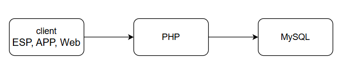

# HTTPClient.h
- các client truy cập vào database thông qua PHP bằng API GET/POST

## API
``` Cpp
HTTPClient http;
http.begin("url website");
http.addHeader("Content-Type", "application/x-www-form-urlencoded");
int httpResponseCode = http.POST("data");
if (httpResponseCode == 200)
{
    return;
}
http.end();

http.GET();
http.getString();

```
## PHP
``` PHP

```
## MySQL
```MySQL

```

## Diagram


